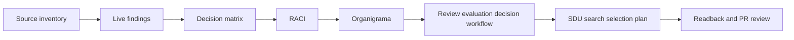

# Agents SDK Live Agent Global Operability Framework

Status: `ACTIVE_REPO_LOCAL_FRAMEWORK`

This framework governs the PR `#101` evidence package. It is not a new Cabina
architecture. It connects existing and newly versioned artifacts into one
reviewable operating contract.

## Scope

In scope:

- sanitized live Agents SDK findings already produced under approved gate;
- decision matrix;
- RACI matrix;
- organigrama;
- review, evaluation and decision workflow;
- SDU search and selection plan;
- readback, indexing and validator coverage.

Out of scope:

- OpenAI or Agents SDK live re-run;
- Microsoft live writes;
- production;
- tenants, permissions, secrets, costs or external writes;
- persistent remote agents;
- seventh SDU-CN canonical agent.

## Operating Chain

## Framework Rules

- Findings are evidence, not authority.
- Decisions are governed actions, not execution by themselves.
- RACI defines ownership before any next lane executes.
- The organigrama defines escalation and gate ownership.
- The workflow defines order and stop conditions.
- SDU agents search, filter, select and narrate under repo-local governance.
- Only `EXECUTE_ON_NEXT_LANE` decisions can move to the next local lane.
- Gated, live, production, worktree or serialized decisions remain parked
  until their explicit gate or serial lane is authorized.

## Close Condition

The framework stops at PR review. Ready promotion, merge precheck or merge
requires explicit human approval with fixed HEAD and green checks.
