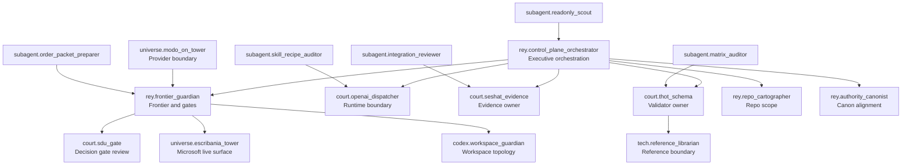

# Agents SDK Live Agent Global Operability Org Chart

Status: `ACTIVE_REVIEW_ORG_CHART`

This map is scoped to PR `#101` and the versioned live evidence package for
`agent_global_operability`. It does not create persistent remote agents and it
does not authorize live writes.

## Operating Rule

- `rey.control_plane_orchestrator` authorizes only repo-scoped next-lane
  packaging in this PR.
- `rey.frontier_guardian` owns live, cost, production, remote mutation and
  worktree gates.
- `court.openai_dispatcher` owns the OpenAI and Agents SDK runtime boundary.
- `court.sdu_gate` reviews decisions and prevents self-approval.
- `court.seshat_evidence` owns evidence and readback continuity.
- `court.thot_schema` owns matrix, schema and validator consistency.

## Stop

Stop at PR review until a human gate explicitly authorizes ready promotion or
merge precheck with fixed HEAD.
