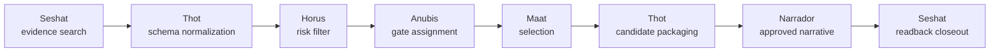

# SDU Search And Selection Plan

Status: `SDU_SEARCH_SELECTION_PLAN_ACTIVE_REPO_LOCAL`

This plan activates the six canonical SDU-CN agents as governance roles for
PR `#101`. It does not create a seventh agent, does not start persistent remote
agents, does not call OpenAI again and does not authorize live writes.

## Agent Roles

- `seshat-normativa`: gathers and preserves sanctioned evidence.
- `thot-tecnico`: normalizes matrix fields, schemas, validators and indexes.
- `horus-riesgo`: filters risky or gated candidates.
- `anubis-gate`: assigns gates, rollback, postcheck and stop conditions.
- `maat-cumplimiento`: selects executable local-only candidates by coherence,
  proportionality and RACI coverage.
- `narrador-normativo`: narrates only after evidence and validation exist.

## Flow

## Selection Rule

Only decisions marked `EXECUTE_ON_NEXT_LANE` can be selected for the next
local lane. Decisions marked `KEEP_GATED`, `REQUIRE_LIVE_GATE`,
`REQUIRE_HUMAN_GATE`, `REQUIRE_WORKTREE_GATE` or `SERIALIZE` remain parked
until their explicit gate or serial lane is approved.

## Stop

Stop at PR review. Ready promotion, merge precheck, live execution, cost,
production, permissions, tenant changes and clone movement require a separate
human gate.
